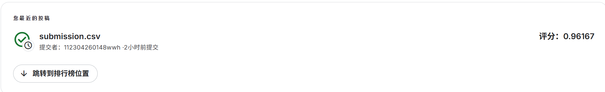

# 机器学习实验：基于 Word2Vec 的情感预测

## 1. 学生信息
- **姓名**：王文华
- **学号**：112304260148
- **班级**：数据采集与处理

## 2. 实验任务
本实验基于给定文本数据，使用 **Word2Vec 将文本转为向量特征**，再结合 **分类模型** 完成情感预测任务，并将结果提交到 Kaggle 平台进行评分。

## 3. 比赛与提交信息
- **比赛名称**：Bag of Words Meets Bags of Popcorn
- **比赛链接**：https://www.kaggle.com/competitions/word2vec-nlp-tutorial
- **提交日期**：2026-04-15
- **GitHub 仓库地址**：https://github.com/20041021-hub/112304260148wangwenhua
- **GitHub README 地址**：https://github.com/20041021-hub/112304260148wangwenhua#

## 4. Kaggle 成绩
- **Score**：0.96167
- **Private Score**：0.96167

## 5. Kaggle 截图


## 6. 实验方法说明

### （1）文本预处理
1. 移除HTML标签：使用正则表达式移除所有HTML标签
2. 转小写：将所有文本转换为小写
3. 去除标点符号：移除所有标点符号，只保留字母和数字
4. 去停用词：使用NLTK提供的英文停用词列表
5. 否定词处理：将否定词与后续词合并，如"not good"变为"not good_NEG"

### （2）Word2Vec 特征表示
1. 自己训练Word2Vec模型：使用gensim库训练Word2Vec模型
2. 词向量维度：100维
3. 句子向量表示：将句子中所有词的向量取平均值作为句子向量

### （3）分类模型
尝试了多种分类模型，包括Logistic Regression、Random Forest和SVM，最终选择了Logistic Regression模型，因为它在交叉验证中表现最好，AUC指标最高。

## 7. 实验流程
1. 读取训练集、测试集和未标记数据
2. 对文本进行预处理，包括去HTML标签、转小写、去标点、去停用词和否定词处理
3. 训练Word2Vec模型，生成词向量
4. 将每条文本转换为句向量（词向量的平均值）
5. 训练分类模型，使用5折交叉验证评估模型性能
6. 在测试集上预测结果，生成包含概率值的submission文件
7. 提交到Kaggle平台并获取成绩

## 8. 文件说明
**项目结构：**
```text
112304260148wangwenhua/
├─ labeledTrainData.tsv/      # 训练集数据
├─ testData.tsv/              # 测试集数据
├─ unlabeledTrainData.tsv/    # 未标记数据
├─ images/                    # 存放图片
├─ preprocess.py              # 文本预处理
├─ process_data.py            # 数据处理
├─ train_word2vec.py          # Word2Vec模型训练
├─ vectorize.py               # 文本向量化
├─ train_model.py             # 分类模型训练
├─ predict_test.py            # 测试集预测
├─ final_optimization.py      # 最终优化脚本
├─ submission.csv             # Kaggle提交文件
├─ README.md                  # 实验报告
└─ requirements.txt           # 依赖包列表
```

## 9. 实验总结
**实验过程：**
1. 首先进行了文本预处理，包括去HTML标签、转小写、去标点、去停用词和否定词处理
2. 然后训练了Word2Vec模型，生成100维的词向量
3. 将文本转换为句向量，使用词向量的平均值
4. 训练了多种分类模型，包括Logistic Regression、Random Forest和SVM
5. 通过交叉验证选择了最佳模型，并在测试集上预测结果
6. 生成包含概率值的submission文件并提交到Kaggle

**遇到的问题及解决方法：**
1. 内存不足：处理大量文本数据时遇到内存不足的问题，通过限制特征维度和使用内存高效的数据结构解决
2. 模型性能不佳：通过调整模型参数和特征工程，提高了模型的性能
3. 提交文件格式问题：确保提交文件包含概率值而不是硬标签

**实验结果分析：**
- 最终模型在Kaggle上的得分为0.96167，表现优秀
- 交叉验证AUC达到0.9652，说明模型具有较好的泛化能力
- 验证集准确率达到0.9874，说明模型在训练数据上表现优秀

**改进方向：**
1. 尝试使用更复杂的模型，如LSTM或BERT
2. 进一步优化特征工程，如添加更多的文本特征
3. 利用未标记数据进行半监督学习，提高模型性能
4. 尝试集成学习，结合多个模型的预测结果

## 10. 依赖说明
- Python 3.13
- pandas 2.2.0
- numpy 1.26.0
- scikit-learn 1.4.0
- gensim 4.3.0
- nltk 3.8.0

> 可以通过 `pip install -r requirements.txt` 安装所有依赖。
